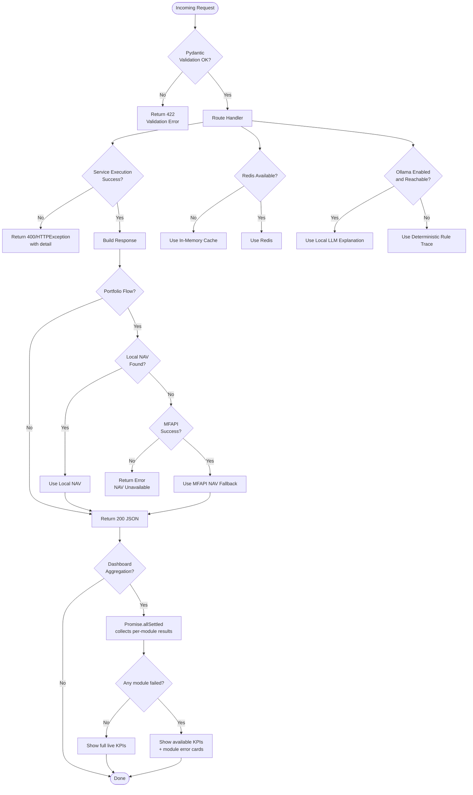

# FinMentor Agentic Architecture Diagram (Image-Ready)

Use these Mermaid blocks in Mermaid Live Editor, VS Code Markdown preview, or any diagram renderer.

---

## 1) System Agent Roles + Communication + Tool Integrations

```mermaid
flowchart TB
  %% =========================
  %% Frontend Layer
  %% =========================
  subgraph FE[Frontend Layer]
    UI[User Interface Pages\nFIRE, Health, Life, Tax, Couples, Portfolio]
    DAS[Dashboard Aggregator\nparallel module refresh]
    APIClient[Shared API Client\nsrc/services/api.ts]
    UI --> APIClient
    DAS --> APIClient
  end

  %% =========================
  %% API / Routing Layer
  %% =========================
  subgraph API[Backend API Layer - FastAPI]
    Main[FastAPI App\napp/main.py]
    Router[API Router\n/api/v1]
    HealthRoute[Health Route]
    FireRoute[FIRE Route]
    ScoreRoute[Health Score Route]
    LifeRoute[Life Event Route]
    TaxRoute[Tax Route]
    CouplesRoute[Couples Route]
    PortRoute[Portfolio Route]

    Main --> Router
    Router --> FireRoute
    Router --> ScoreRoute
    Router --> LifeRoute
    Router --> TaxRoute
    Router --> CouplesRoute
    Router --> PortRoute
    Router --> HealthRoute
  end

  APIClient --> Router

  %% =========================
  %% Domain Agents (Service Layer)
  %% =========================
  subgraph AGENTS[Domain Agents / Engines]
    FireAgent[FIRE Agent\nfinancial_engine.py]
    ScoreAgent[Money Health Agent\nrisk_engine.py]
    MlAgent[ML Calibrator Agent\nml_scoring.py]
    LifeAgent[Life Event Agent\nlife_event_engine.py]
    TaxAgent[Tax Agent\ntax_engine.py]
    CouplesAgent[Couples Optimization Agent\noptimization_engine.py]
    PortAgent[Portfolio X-Ray Agent\nportfolio_engine.py]
    ExplainAgent[Explainability Agent\nexplainability.py]
  end

  FireRoute --> FireAgent
  ScoreRoute --> ScoreAgent
  LifeRoute --> LifeAgent
  TaxRoute --> TaxAgent
  CouplesRoute --> CouplesAgent
  PortRoute --> PortAgent

  ScoreAgent --> MlAgent
  FireAgent --> ExplainAgent
  ScoreAgent --> ExplainAgent
  LifeAgent --> ExplainAgent
  TaxAgent --> ExplainAgent
  CouplesAgent --> ExplainAgent
  PortAgent --> ExplainAgent

  %% =========================
  %% Tools / Quant Utilities
  %% =========================
  subgraph TOOLS[Quant + Rule Tool Integrations]
    TVM[TVM + SIP Formulas\nutils/finance.py]
    MC[Monte Carlo Simulator\nutils/monte_carlo.py]
    RuleEngine[Rule Engine\nutils/rule_engine.py]
    GridSearch[Constraint Optimizer\nutils/optimization.py]
    XIRR[XIRR Engine\nutils/xirr.py]
  end

  FireAgent --> TVM
  FireAgent --> MC
  ScoreAgent --> RuleEngine
  LifeAgent --> RuleEngine
  CouplesAgent --> GridSearch
  PortAgent --> XIRR

  %% =========================
  %% Data Integration Layer
  %% =========================
  subgraph DATA[Data + Infra Integrations]
    NAVRepo[Local NAV Repository\nnav_repository.py\n(data_source/NAVAII.txt)]
    MFAPI[MFAPI Client\nmfapi_client.py]
    Alpha[Alpha Vantage Client\nalpha_vantage_client.py]
    Redis[Redis Cache Client\ncache.py]
    MemoryCache[In-Memory Cache Fallback]
    Encrypt[Encryption Service\nsecurity.py]
    Ollama[Optional Local Ollama\nfor explanation text]
  end

  PortAgent --> NAVRepo
  PortAgent --> MFAPI
  PortRoute --> Alpha
  AGENTS --> Redis
  Redis -.unavailable.-> MemoryCache
  AGENTS --> Encrypt
  ExplainAgent --> Ollama

  %% =========================
  %% Visual grouping styles
  %% =========================
  classDef frontend fill:#e6f2ff,stroke:#2b6cb0,color:#1a365d;
  classDef api fill:#f0fff4,stroke:#2f855a,color:#1c4532;
  classDef agent fill:#fffaf0,stroke:#c05621,color:#7b341e;
  classDef tools fill:#faf5ff,stroke:#6b46c1,color:#44337a;
  classDef data fill:#f7fafc,stroke:#4a5568,color:#2d3748;

  class UI,DAS,APIClient frontend;
  class Main,Router,HealthRoute,FireRoute,ScoreRoute,LifeRoute,TaxRoute,CouplesRoute,PortRoute api;
  class FireAgent,ScoreAgent,MlAgent,LifeAgent,TaxAgent,CouplesAgent,PortAgent,ExplainAgent agent;
  class TVM,MC,RuleEngine,GridSearch,XIRR tools;
  class NAVRepo,MFAPI,Alpha,Redis,MemoryCache,Encrypt,Ollama data;
```

---

## 2) Error-Handling and Fallback Logic (Execution Diagram)



---

## 3) Agent Role Description (for diagram annotation)

### A. Orchestration Roles

1. **Frontend Orchestrator (Dashboard Aggregator)**
   - Triggers multiple backend modules in parallel.
   - Merges successful responses and surfaces partial failures safely.

2. **API Gateway Role (FastAPI Router)**
   - Validates inputs via typed schemas.
   - Dispatches requests to specialized domain agents.

### B. Domain Agent Roles

1. **FIRE Agent**
   - Retirement corpus, SIP, roadmap, Monte Carlo outcomes.
   - Uses TVM + simulation tools.

2. **Money Health Agent**
   - Weighted health score + recommendation rules.
   - Uses ML calibrator for score refinement.

3. **Life Event Agent**
   - Event-specific split optimization using financial heuristics.
   - Produces tax/liquidity-aware recommendations.

4. **Tax Agent**
   - Old vs New regime computation, deduction optimization.
   - Includes section-based limits and cess logic.

5. **Couples Optimization Agent**
   - Joint tax minimization with constrained allocation split.
   - Uses grid-search optimization.

6. **Portfolio X-Ray Agent**
   - Statement parsing, reconstruction, XIRR, overlap, expense drag.
   - Uses local NAV first, then mfapi fallback.

### C. Support Agent Roles

1. **Explainability Agent**
   - Default: deterministic rule-trace explanation.
   - Optional: local Ollama summarization if enabled.

2. **Data Integration Agents**
   - Local NAV repository (primary)
   - MFAPI client (fallback)
   - Alpha Vantage client (market data)

3. **Infra Agents**
   - Cache agent: Redis with in-memory fallback
   - Security agent: encryption/decryption service

---

## 4) Communication Model (Simple Narrative)

1. Frontend sends typed JSON requests to backend module endpoints.
2. Route validates payload and forwards to a domain agent.
3. Domain agent calls required quant/rule/ML tools.
4. If data required, agent uses local data source first, then fallback APIs.
5. Response returns structured analytics + explainability metadata.
6. Dashboard optionally aggregates multiple module responses in parallel.
7. Partial failures do not break full page; degraded mode is shown.

---

## 5) Image generation prompt (optional)

If you are using an AI image tool, this prompt can help:

"Create a professional fintech architecture diagram showing a modular agentic backend. Include frontend UI pages and a dashboard aggregator; FastAPI API gateway; domain agents for FIRE, Health Score, Life Events, Tax, Couples Optimization, Portfolio X-Ray; tool layer with TVM, Monte Carlo, Rule Engine, Grid Search, XIRR; data layer with local NAV file primary, MFAPI fallback, Alpha Vantage, Redis with in-memory fallback, and encryption service. Show arrows for communication flow and explicit error-handling paths for validation errors, service exceptions, fallback switching, and partial dashboard degradation mode. Use clean enterprise style, white background, blue/green/orange grouped swimlanes, and clear directional arrows."
